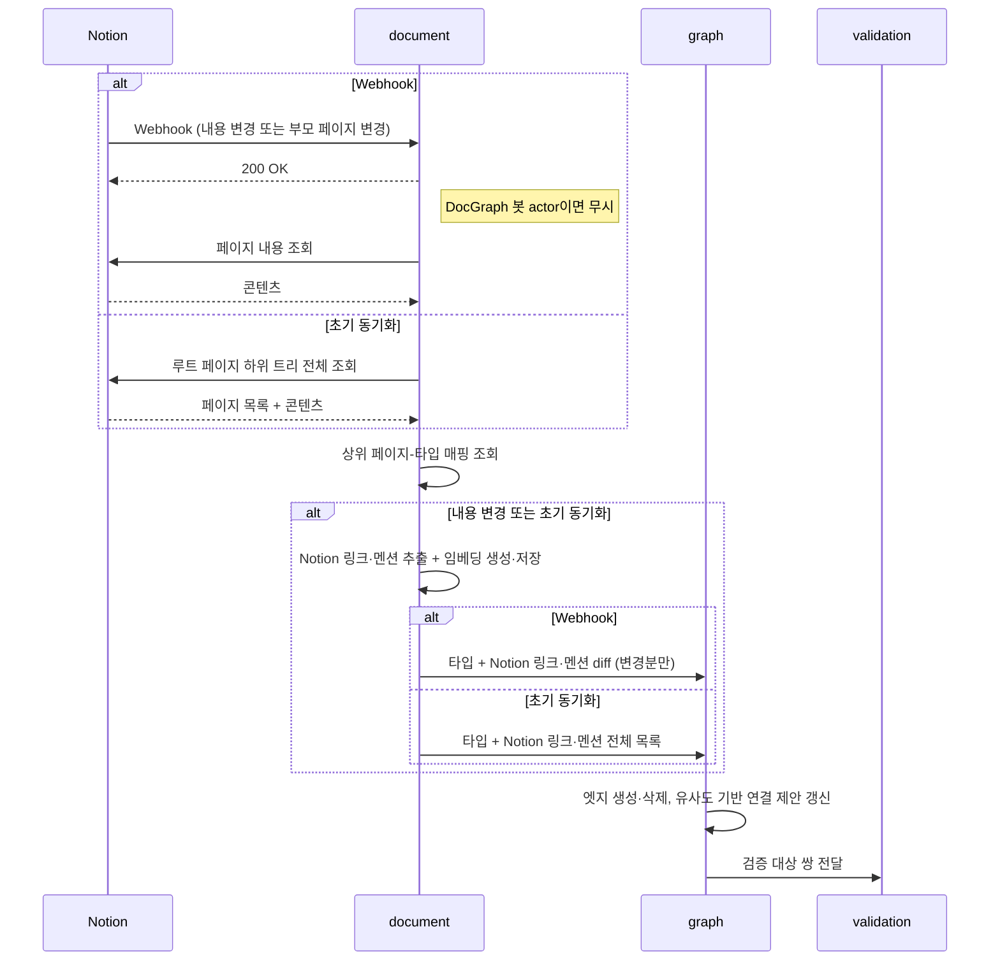
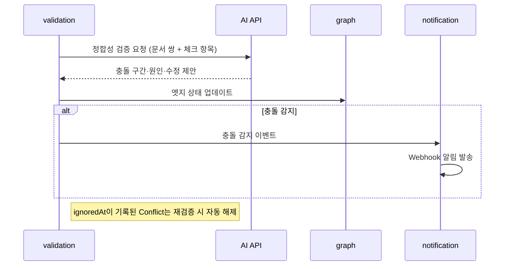

# 도메인 정의

## 개요

7개 도메인으로 구성한다. 전체 흐름은 두 축으로 나뉜다.

### 변경 감지

그래프 상태(문서·타입·엣지)를 최신으로 유지한다. 트리거에 따라 처리 방식이 다르다.

| 트리거 | 타입 재분류 | 임베딩 갱신 | 엣지 재평가 |
| --- | --- | --- | --- |
| Webhook — 내용 변경 | 불필요 | 재생성 | Notion 링크·멘션 diff |
| Webhook — 부모 페이지 변경 | 재분류 | 불필요 | 타입 변경 시 재평가 |
| 초기 동기화 | 필요 | 생성 | 전체 생성 |

### 정합성 검사

엣지가 생기거나 연결된 문서 내용이 바뀌면 `graph`가 `validation`으로 검증 대상 쌍을 전달한다. 변경 감지 완료, 연결 제안 수락, 수동 엣지 추가 모두 동일한 경로다.

---

## auth

Notion OAuth 인증과 세션 관리를 담당한다. 별도 회원가입 플로우 없이 Notion OAuth가 계정 생성을 겸한다.

**핵심 개념**
- Notion OAuth 토큰 (암호화 저장)
- 세션

**경계**
- 워크스페이스 멤버십(초대, 제거)은 `workspace` 도메인 책임

---

## workspace

워크스페이스 등록과 멤버 관리를 담당한다.

**핵심 개념**
- 워크스페이스 (Notion 워크스페이스 연결 단위)
- 워크스페이스 생성자 (createdBy) — 멤버 초대·프로젝트 생성 권한, 모든 프로젝트의 Project Admin 권한 자동 부여
- 멤버 (워크스페이스에 초대된 사용자, 역할은 프로젝트 단위로 구분)

**경계**
- 프로젝트 단위 멤버 배정·역할(Admin/Member) 관리는 `project` 도메인 책임
- Notion API 호출은 `document` 도메인 책임

---

## project

워크스페이스 내 프로젝트 관리를 담당한다. 프로젝트는 Notion 루트 페이지 하위 트리 단위로 정합성 검증 범위를 구분한다.

**핵심 개념**
- 프로젝트 (Notion 루트 페이지 하위 트리 → DocGraph 프로젝트)
- 프로젝트 멤버십 (Admin / Member 역할)
- 상위 페이지-타입 매핑 (직계 상위 페이지 → 문서 타입)
- 타입별 담당자 기본값 (멤버, 개별 문서에서 오버라이드 가능)

**주요 흐름**
- 워크스페이스 멤버를 프로젝트에 배정하고 역할 부여
- 상위 페이지-타입 매핑 설정 (프로젝트 생성 시 Notion 페이지 트리 불러와 매핑)
- 타입별 담당자 기본값 설정
- 초기 동기화 트리거 (수동)

**경계**
- 프로젝트 간 정합성 검증은 지원하지 않음
- Notion 페이지 트리 조회는 `document` 도메인 책임

---

## document

Notion 문서의 동기화와 타입 분류를 담당한다. 변경 감지 흐름의 진입점이다.

**핵심 개념**
- Document (Notion 페이지 스냅샷, 타입: `meeting_notes` / `planning` / `requirements` / `design` / `research`)

**주요 흐름 — 내용 변경 (Webhook)**
1. Webhook actor 확인 — DocGraph 봇 actor이면 재처리 없이 종료
2. Notion API로 변경된 페이지 전체 내용 조회
3. 상위 페이지-타입 매핑 조회 (타입 고정, 재분류 불필요)
4. Notion 링크·멘션 추출 및 임베딩 재생성·저장 → `graph`로 전달

**주요 흐름 — 부모 페이지 변경 (Webhook)**
1. Webhook actor 확인
2. 변경된 부모 페이지로 상위 페이지-타입 매핑 재조회
3. 타입 변경이 있으면 `graph`에 타입 변경 통보 (임베딩 재생성 불필요)

**주요 흐름 — 초기 동기화**
1. `project`로부터 동기화 트리거 수신
2. Notion API로 루트 페이지 하위 트리 전체 조회
3. 각 페이지에 대해 내용 변경 흐름과 동일하게 처리

**경계**
- 상위 페이지-타입 매핑 설정은 `project` 도메인 책임
- 의존 관계 생성은 `graph` 도메인 책임
- AI 검증 로직은 `validation` 책임

---

## graph

문서 간 의존 관계를 모델링한다. 변경 감지에서 write, 정합성 검사에서 read로 양쪽 흐름에 관여하므로 독립 도메인으로 분리한다.

**핵심 개념**
- DependencyEdge (출발 문서 → 도착 문서, 체크 항목, 충돌 상태)
- EdgeProposal (연결 제안, 유사도 점수 포함)
- Rule (타입 조합별 엣지 자동 생성 규칙, UI 타입 그래프로 시각화)

**주요 흐름**
- 타입·링크 정보 수신 시 룰 테이블 조회 → Notion 링크·멘션 있으면 엣지 자동 생성
- (P1) Notion 링크·멘션 없는 경우 룰 타입 조합 후보 중 저장된 임베딩 기반 하이브리드 검색으로 유사도 상위 N개를 EdgeProposal로 생성
- 타입 변경 수신 시 기존 엣지·제안 중 룰과 불일치하는 항목 삭제, 새 룰에 따라 재평가
- (P1) Admin이 EdgeProposal 수락 시 DependencyEdge로 전환 → 정합성 검증 대기열에 추가
- (P2) Admin이 커스텀 엣지 추가 시 → 정합성 검증 대기열에 추가
- (P2) Admin의 커스텀 룰 추가/삭제

**기본 제공 룰**

| 출발 | 도착 | 체크 항목 |
| --- | --- | --- |
| `meeting_notes` | `planning` | 결정사항 반영 여부 |
| `meeting_notes` | `requirements` | 결정사항 반영 여부 |
| `research` | `planning` | 전제 조건 유지 여부 |
| `planning` | `requirements` | 범위 일치 여부 |
| `requirements` | `design` | 스펙 일치 여부 |

**엣지 방향 의미**
- source → target 방향은 "source 내용이 target에 반영되어야 함"을 의미한다.
- 커스텀 엣지·룰 추가 시에도 이 의미를 따른다.
- 양방향 동기화가 필요한 경우 단방향 엣지 두 개(A→B, B→A)로 표현한다. 각 엣지의 target 담당자가 독립적으로 책임진다.

**경계**
- 엣지는 동일 프로젝트 내 문서 간에만 생성

---

## validation

AI 기반 정합성 검증과 충돌 상태 관리를 담당한다. 담당자별 인박스 조회를 제공한다.

**핵심 개념**
- ValidationRun (검증 실행 이력, 상태: `pending` / `success` / `failed`)
- Conflict (열린 위반. `ignoredAt`, `ignoredBy`, `ignoreReason?` 필드를 가질 수 있음)
- ConflictResult (충돌 구간, 원인, 수정 제안 — ValidationRun에 귀속)
- 충돌 해소는 별도 상태가 아닌 Conflict 레코드의 비활성화로 표현. 이력은 물리 삭제 없이 보존.

**담당자 라우팅**
- 엣지 방향은 "source 문서의 내용이 target 문서에 반영되어야 함"을 의미한다.
- 충돌 수정 책임은 target 문서 담당자에게 귀속된다.
- target 문서 담당자가 없으면 해당 프로젝트의 모든 Project Admin에게 귀속된다.
- source 문서 담당자는 알림 대상이 아니며 참조 정보로만 표시한다.

**주요 흐름**
1. `graph`로부터 검증 대상 쌍 수신 (변경 감지, 제안 수락, 수동 엣지 추가 경로 모두 동일)
2. AI API non-blocking 호출 (타임아웃 30초)
3. ValidationRun 결과 저장, `graph`의 엣지 상태 업데이트
4. 충돌 감지 시 기존 Conflict 갱신 또는 신규 생성, `notification`으로 이벤트 발행
5. 재검증 결과 충돌 없음: 기존 Conflict 비활성화 (`ignored` 포함 해제)
6. 사용자의 수동 무시 마킹 처리 — 해당 문서 쌍 재검증 시 자동 해제
7. 담당자 기준 미해소 충돌 목록 조회 (인박스)

**경계**
- 동일 이벤트 재처리 시 중복 검증 방지 (idempotency)
- 한 문서 쌍의 검증 실패가 다른 쌍에 영향을 주지 않아야 함 (실패 격리)

---

## notification (P2)

외부 알림 발송을 담당한다. `validation`으로부터 충돌 감지 이벤트를 수신한다.

**주요 흐름**
1. 충돌 감지 이벤트 수신
2. 프로젝트 Webhook URL로 알림 발송 (Slack·Discord 호환)

**경계**
- Webhook 알림 발송 실패 시에도 인앱 위반 표시는 `validation`이 유지
