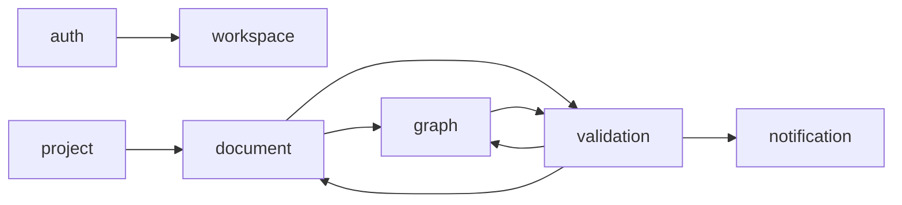
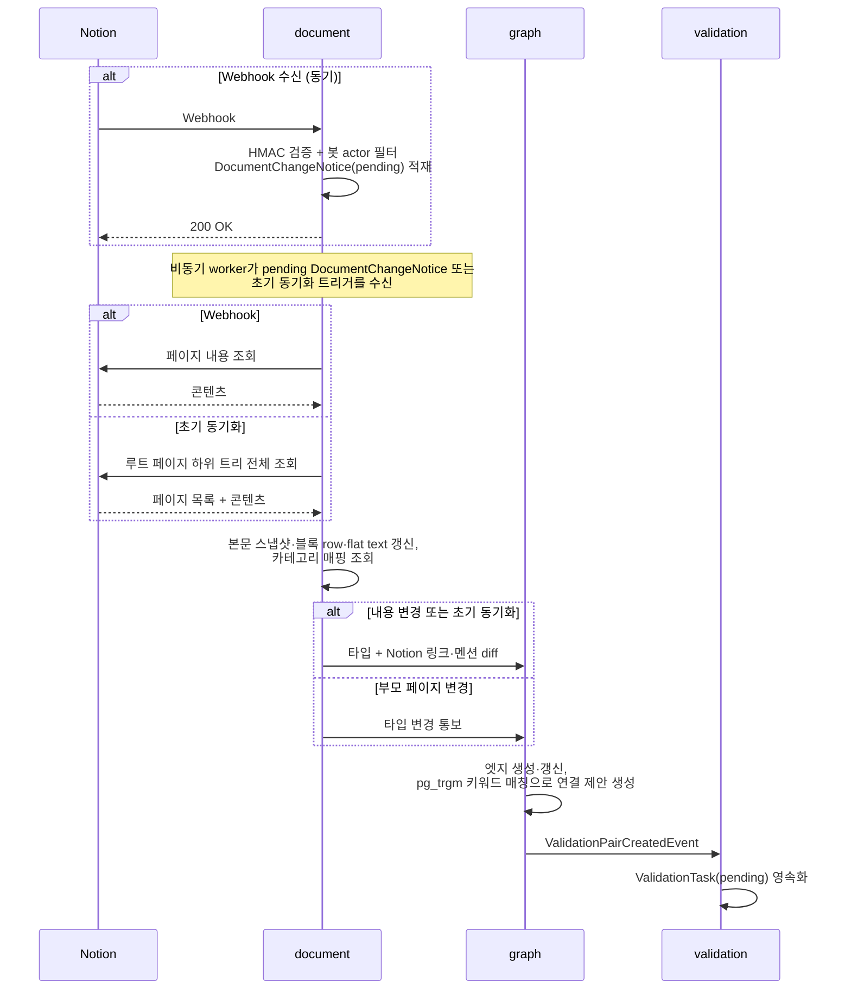
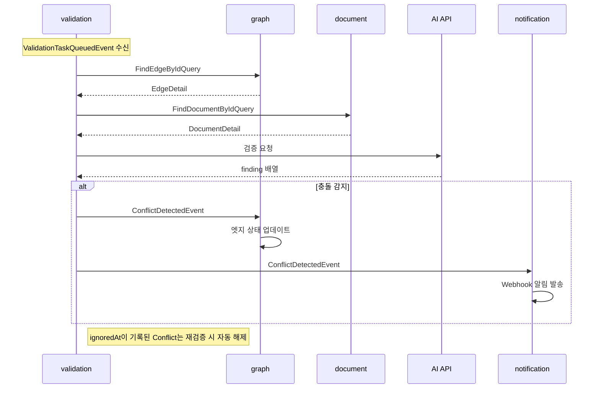

# 도메인 정의

## 개요

7개 도메인으로 구성한다.

```mermaid
flowchart LR
    Auth[auth]
    Workspace[workspace]
    Project[project]
    Document[document]
    Graph[graph]
    Validation[validation]
    Notification[notification]

    Auth --> Workspace
    Project --> Document
    Document --> Graph
    Document --> Validation
    Graph --> Validation
    Validation --> Graph
    Validation --> Document
    Validation --> Notification
```

> 화살표: 도메인 간 이벤트 흐름. Query API 의존은 각 도메인의 카탈로그 표 참조.

전체 흐름은 두 축으로 나뉜다.

### 변경 감지

그래프 상태(문서·타입·엣지)를 최신으로 유지한다. 트리거에 따라 처리 방식이 다르다.

| 트리거 | 본문 스냅샷·블록 row | 타입 재분류 | 엣지 재평가 |
| --- | --- | --- | --- |
| Webhook — 내용 변경 | 갱신 | 불필요 | Notion 링크·멘션 diff |
| Webhook — 부모 페이지 변경 | 불필요 | 재분류 | 타입 변경 시 재평가 |
| 초기 동기화 | 생성 | 필요 | 전체 생성 |

Webhook 수신은 동기 트랜잭션에서 `DocumentChangeNotice(pending)` 적재 + 200 OK까지만 처리한다. 본문 조회·갱신·엣지 재평가·검증 대상 쌍 전달은 비동기 worker가 이어 받는다.

```mermaid
sequenceDiagram
    participant Notion
    participant document
    participant graph
    participant validation

    alt Webhook 수신 (동기)
        Notion->>document: Webhook
        document->>document: HMAC 검증 + 봇 actor 필터<br/>DocumentChangeNotice(pending) 적재
        document-->>Notion: 200 OK
    end

    Note over document: 비동기 worker가 pending DocumentChangeNotice 또는<br/>초기 동기화 트리거를 수신
    alt Webhook
        document->>Notion: 페이지 내용 조회
        Notion-->>document: 콘텐츠
    else 초기 동기화
        document->>Notion: 루트 페이지 하위 트리 전체 조회
        Notion-->>document: 페이지 목록 + 콘텐츠
    end
    document->>document: 본문 스냅샷·블록 row·flat text 갱신,<br/>카테고리 매핑 조회
    alt 내용 변경 또는 초기 동기화
        document->>graph: 타입 + Notion 링크·멘션 diff
    else 부모 페이지 변경
        document->>graph: 타입 변경 통보
    end
    graph->>graph: 엣지 생성·갱신,<br/>pg_trgm 키워드 매칭으로 연결 제안 생성
    graph->>validation: ValidationPairCreatedEvent
    validation->>validation: ValidationTask(pending) 영속화
```

### 정합성 검사

엣지가 생기거나 연결된 문서 내용이 바뀌면 `graph`가 `validation`으로 검증 대상 쌍을 전달한다. 변경 감지 완료, 연결 제안 수락, 수동 엣지 추가 모두 동일한 경로다. 한 검증 대상 쌍 = `ValidationTask` 1건 = AI 호출 1건이며, 실패 격리 단위가 된다.

```mermaid
sequenceDiagram
    participant validation
    participant graph
    participant document
    participant AI as AI API
    participant notification

    Note over validation: ValidationTaskQueuedEvent 수신
    validation->>graph: FindEdgeByIdQuery
    graph-->>validation: EdgeDetail
    validation->>document: FindDocumentByIdQuery
    document-->>validation: DocumentDetail
    validation->>AI: 검증 요청
    AI-->>validation: finding 배열
    alt 충돌 감지
        validation->>graph: ConflictDetectedEvent
        graph->>graph: 엣지 상태 업데이트
        validation->>notification: ConflictDetectedEvent
        notification->>notification: Webhook 알림 발송
    end
    Note right of validation: ignoredAt이 기록된 Conflict는 재검증 시 자동 해제
```

---

## auth

Notion OAuth 인증과 세션 관리를 담당한다. 별도 회원가입 플로우 없이 Notion OAuth가 계정 생성을 겸한다.

**핵심 개념**
- Notion OAuth 토큰 (암호화 저장)
- 세션

**주요 흐름 — OAuth 인증**
1. 사용자가 `GET /oauth2/authorization/notion` 진입
2. Notion authorization 페이지로 리다이렉트, 사용자 동의
3. callback 수신 → Notion에서 access token + 워크스페이스 정보 교환
4. 사용자 계정 upsert (Notion 이메일·이름 기반, 신규면 생성)
5. 세션 생성 + 클라이언트 세션 쿠키 발급
6. `NotionWorkspaceAuthorizedEvent` 발행 (워크스페이스 등록 트리거)
7. 클라이언트로 redirect 응답

**주요 흐름 — 세션**
- 현재 사용자 조회 (`GET /auth/me`): 세션 → 사용자 식별
- 로그아웃 (`DELETE /auth/sessions`): 세션 무효화

**경계**
- 워크스페이스 멤버십(초대, 제거)은 `workspace` 도메인 책임

**도메인 간 인터페이스 — Event**

| 이름 | 트리거 | 소비자 | 처리 |
| --- | --- | --- | --- |
| `NotionWorkspaceAuthorizedEvent` | Notion OAuth 콜백 완료 | workspace | 워크스페이스 자동 등록 + 생성자 자격 부여 |

**도메인 간 인터페이스 — Query API**

| 이름 | 소비자 | 호출 의도 |
| --- | --- | --- |
| `GetCurrentUserIdQuery` | workspace·project·validation·document | REST 요청의 인증된 사용자 식별 |
| `FindUserIdByEmailQuery` | workspace | 멤버 초대 시 이메일로 기존 사용자 식별 |
| `SearchUserAccountsByIdsQuery` | workspace, project | 상세 조회 응답 보강 시 멤버 사용자 정보(이메일·이름) 일괄 조회 |

---

## workspace

워크스페이스 등록과 멤버 관리를 담당한다.

**핵심 개념**
- 워크스페이스 (Notion 워크스페이스 연결 단위)
- 워크스페이스 생성자 (createdBy) — 멤버 초대·프로젝트 생성 권한, 모든 프로젝트의 Project Admin 권한 자동 부여
- 멤버 (워크스페이스에 초대된 사용자, 역할은 프로젝트 단위로 구분)

**주요 흐름**
- 워크스페이스 등록 (`auth`의 `NotionWorkspaceAuthorizedEvent` 수신 → 워크스페이스·생성자 멤버 영속화)
- 멤버 초대 (이메일로 기존 사용자 식별 후 워크스페이스 멤버로 추가)
- 멤버 제거 (워크스페이스 멤버 해제)
- 워크스페이스 조회 (사용자 접근 가능 목록 + 멤버 사용자 정보 보강)

**경계**
- 프로젝트 단위 멤버 배정·역할(Admin/Member) 관리는 `project` 도메인 책임
- Notion API 호출은 `document` 도메인 책임

**도메인 간 인터페이스 — Query API**

| 이름 | 소비자 | 호출 의도 |
| --- | --- | --- |
| `FindWorkspaceIdByMemberIdQuery` | project | 프로젝트 멤버 배정·타입 담당자 설정 시 멤버의 워크스페이스 검증 |
| `FindWorkspaceMemberIdByUserIdQuery` | project | 사용자의 워크스페이스 멤버 자격·멤버 ID 식별(권한 검증·프로젝트 멤버 등록) |
| `FindWorkspaceCreatorIdByIdQuery` | project, document | project는 프로젝트 등록 시 워크스페이스 생성자에게 Project Admin 자동 부여; document는 Notion 페이지 브라우징 시 워크스페이스 생성자 게이트 |

---

## project

워크스페이스 내 프로젝트 관리를 담당한다. 프로젝트는 Notion 루트 페이지 하위 트리 단위로 정합성 검증 범위를 구분한다.

**핵심 개념**
- 프로젝트 (Notion 루트 페이지 하위 트리 → DocGraph 프로젝트)
- 프로젝트 멤버십 (Admin / Member 역할)
- 카테고리 (프로젝트 루트의 직계 자식 페이지 → 문서 타입 매핑)
- 타입별 담당자 기본값 (멤버, 개별 문서에서 오버라이드 가능)

**주요 흐름**
- 프로젝트 등록 (워크스페이스 + Notion 루트 페이지 → 프로젝트 영속, 워크스페이스 생성자에게 Project Admin 자동 부여)
- 카테고리 설정 (프로젝트 생성 시 루트 페이지의 직계 자식 목록 불러와 타입 매핑)
- 워크스페이스 멤버를 프로젝트에 배정하고 역할(Admin/Member) 부여
- 타입별 담당자 기본값 설정
- 초기 동기화 트리거 (수동, `ProjectSyncTriggeredEvent` 발행)
- 프로젝트 삭제 (`ProjectDiscardedEvent` 발행 — 연관 도메인 cascade 정리)

**경계**
- 프로젝트 간 정합성 검증은 지원하지 않음
- Notion 페이지 트리 조회는 `document` 도메인 책임

**도메인 간 인터페이스 — Event**

| 이름 | 트리거 | 소비자 | 처리 |
| --- | --- | --- | --- |
| `ProjectSyncTriggeredEvent` | 초기/수동 동기화 트리거 | document | 프로젝트 루트 페이지 하위 트리 동기화 |
| `ProjectDiscardedEvent` | 프로젝트 삭제 | document | 프로젝트 소속 문서·블록 정리 |
| `ProjectDiscardedEvent` | 프로젝트 삭제 | graph | 프로젝트 소속 엣지·제안·룰 정리 |
| `ProjectDiscardedEvent` | 프로젝트 삭제 | validation | 프로젝트 소속 검증 작업·충돌 정리 |
| `ProjectDiscardedEvent` | 프로젝트 삭제 | notification | 프로젝트 webhook 설정 정리 |

**도메인 간 인터페이스 — Query API**

| 이름 | 소비자 | 호출 의도 |
| --- | --- | --- |
| `SearchCategoriesByProjectQuery` | document | 페이지 동기화 시 조상 라인 카테고리 매핑으로 문서 타입 결정 |
| `SearchAdminProjectIdsByUserIdQuery` | validation, notification | 인박스 라우팅 — target 담당자 부재 시 Project Admin 귀속; notification은 webhook 설정·조회 시 Project Admin 권한 검증 |
| `SearchProjectIdsByWorkspaceIdsQuery` | workspace | 워크스페이스 카드 응답 조립 — workspace별 프로젝트 ID 묶음 조회 |
| `SearchProjectRefsByIdsQuery` | validation, notification | 인박스 라우팅·충돌 알림 — 프로젝트 ID 묶음으로 이름 조회 |

---

## document

Notion 문서의 동기화와 타입 분류를 담당한다. 변경 감지 흐름의 진입점이다.

**핵심 개념**
- Document (Notion 페이지 스냅샷, 타입: `meeting_notes` / `planning` / `requirements` / `design` / `research`)
  - JSONB 본문(블록 트리 원본) + flat text 컬럼(평탄화 평문, `pg_trgm` 검색·LLM 입력에 사용)
  - 같은 프로젝트 내 부모 Document 참조 (Notion 페이지 트리 미러, 루트·경계 밖이면 null)
- Block (Notion `block_id` PK, 소속 Document, 부모 블록, 타입, 텍스트, 순서) — 충돌이 가리킬 최소 주소 단위
- DocumentChangeNotice (외부 source가 통보한 문서 변경 통지, 상태: `pending` / `success` / `failed`) — 동기 트랜잭션과 비동기 변경 감지 사이의 outbox

**주요 흐름 — Webhook 수신 (동기)**
1. HMAC 서명 검증
2. Webhook actor 확인 — DocGraph 봇 actor이면 재처리 없이 종료
3. `DocumentChangeNotice(pending)` 적재 후 200 OK 응답

**주요 흐름 — 내용 변경 (비동기 worker)**
1. `DocumentChangeNotice(pending)` 1건 수신
2. Notion API로 변경된 페이지 전체 내용 조회
3. 본문 스냅샷(JSONB) · 블록 row · flat text 컬럼 갱신
4. 조상 라인의 카테고리 매핑으로 타입 결정 (타입 고정, 재분류 불필요)
5. Notion 링크·멘션 diff → `graph`로 전달
6. `DocumentChangeNotice` 상태를 `done`으로 갱신

**주요 흐름 — 부모 페이지 변경 (비동기 worker)**
1. `DocumentChangeNotice(pending)` 1건 수신
2. 변경된 부모 페이지 기준으로 조상 라인의 카테고리 매핑 재조회
3. 타입 변경이 있으면 `graph`에 타입 변경 통보 (본문 갱신 불필요)
4. `DocumentChangeNotice` 상태를 `done`으로 갱신

**주요 흐름 — 초기 동기화**
1. `project`로부터 동기화 트리거 수신
2. Notion API로 루트 페이지 하위 트리 전체 조회
3. 각 페이지에 대해 내용 변경 흐름과 동일하게 처리 (본문 스냅샷·블록 row·flat text 갱신, 매핑 조회, 링크·멘션 추출)

**주요 흐름 — 충돌 해소 Notion 쓰기 (비동기 listener)**
1. `validation`의 `ProposalApprovedEvent` 수신
2. `FindConflictFindingByIdQuery`로 finding 본문(`target_block_id`, `new_text`) 조회
3. target 블록을 `new_text`로 교체 (Notion API 쓰기)
4. 쓰기 성공 시 `NotionWriteSucceededEvent` 발행
5. 자기 쓰기로 발생한 webhook은 봇 actor 필터로 재처리되지 않음

**경계**
- 카테고리 설정은 `project` 도메인 책임
- 의존 관계 생성은 `graph` 도메인 책임
- AI 검증 로직은 `validation` 책임
- worker 실패 시 `DocumentChangeNotice`는 `pending` 또는 `failed`로 남아 retry · stale row 재처리 worker가 재시도

**도메인 간 인터페이스 — Event**

| 이름 | 트리거 | 소비자 | 처리 |
| --- | --- | --- | --- |
| `DocumentContentChangedEvent` | 문서 본문 변경 (webhook 또는 초기 동기화) | graph | Notion 링크·멘션 diff로 엣지 재평가 |
| `DocumentTypeChangedEvent` | 문서 타입 재분류 (부모 페이지 변경) | graph | 룰 기반 엣지·제안 재평가 |
| `NotionWriteSucceededEvent` | 수정 제안의 Notion 쓰기 성공 | validation | 해당 Conflict 자동 해소 |

**도메인 간 인터페이스 — Query API**

| 이름 | 소비자 | 호출 의도 |
| --- | --- | --- |
| `FindDocumentByIdQuery` | validation | ValidationTask 처리·제안 수락 시 양쪽 문서 본문·블록 조회 |
| `SearchDocumentIdsByAssigneeQuery` | validation | 인박스 라우팅 — 사용자가 담당자로 지정된 문서 식별 |
| `SearchUnassignedDocumentIdsByProjectQuery` | validation | 인박스 라우팅 — 담당자 미지정 문서를 Project Admin에게 귀속 |
| `SearchDocumentStatsByProjectIdsQuery` | project, workspace | 카드 응답 조립 — 프로젝트별 문서 수·Notion 최근 변경 시각 조회 |
| `SearchDocumentReferencesByIdsQuery` | validation, notification | 인박스·충돌 알림 — 문서 ID 묶음으로 제목·프로젝트 조회 |

---

## graph

문서 간 의존 관계를 모델링한다. 변경 감지에서 write, 정합성 검사에서 read로 양쪽 흐름에 관여하므로 독립 도메인으로 분리한다.

**핵심 개념**
- DependencyEdge (출발 문서 → 도착 문서, 검증 기준, 충돌 상태)
- EdgeProposal (연결 제안, 키워드 매칭 점수 포함)
- Rule (타입 조합별 엣지 자동 생성 규칙, UI 타입 그래프로 시각화)

**주요 흐름**
- 타입·링크 정보 수신 시 룰 테이블 조회 → Notion 링크·멘션 있으면 엣지 자동 생성
- Notion 링크·멘션 없는 경우 룰 타입 조합 후보 중 `pg_trgm` 키워드 매칭으로 상위 N개를 EdgeProposal로 생성
- 타입 변경 수신 시 기존 엣지·제안 중 룰과 불일치하는 항목 삭제, 새 룰에 따라 재평가
- Admin이 EdgeProposal 수락 시 DependencyEdge로 전환 → 정합성 검증 대기열에 추가
- Admin이 커스텀 엣지 추가 시 → 정합성 검증 대기열에 추가
- Admin의 커스텀 룰 추가/삭제
- `validation`의 `ConflictDetectedEvent` 수신 시 엣지 충돌 상태 표시 (UI 빨간색)
- `validation`의 `ConflictResolvedEvent` 수신 시 엣지 충돌 상태 복원

**기본 제공 룰**

| 출발 | 도착 | 검증 기준 |
| --- | --- | --- |
| `meeting_notes` | `planning` | 결정사항 반영 여부 |
| `meeting_notes` | `requirements` | 결정사항 반영 여부 |
| `research` | `planning` | 전제 조건 유지 여부 |
| `planning` | `requirements` | 범위 일치 여부 |
| `requirements` | `design` | 스펙 일치 여부 |

**엣지 방향 의미**
- source → target 방향은 "source 내용이 target에 반영되어야 함"을 의미한다.
- 커스텀 엣지·룰 추가 시에도 이 의미를 따른다.
- 양방향 동기화가 필요한 경우 단방향 엣지 두 개(A→B, B→A)로 표현한다. 각 엣지의 target 담당자가 독립적으로 책임진다.

**경계**
- 엣지는 동일 프로젝트 내 문서 간에만 생성

**도메인 간 인터페이스 — Event**

| 이름 | 트리거 | 소비자 | 처리 |
| --- | --- | --- | --- |
| `ValidationPairCreatedEvent` | 엣지 자동 생성·재평가 또는 제안 수락 후 검증 대상 쌍 확정 | validation | `ValidationTask(pending)` 영속화(검증 대기열 등록) |

**도메인 간 인터페이스 — Query API**

| 이름 | 소비자 | 호출 의도 |
| --- | --- | --- |
| `FindEdgeByIdQuery` | validation, notification | ValidationTask 처리·제안 수락 시 엣지(source/target 문서·검증 기준) 조회; notification은 충돌 알림 시 엣지의 프로젝트·문서 식별 |
| `SearchEdgeDetailsByProjectQuery` | validation | 프로젝트 충돌 목록 조회 시 엣지 정보 join |
| `SearchEdgeIdsByProjectQuery` | validation | 프로젝트 검증 작업 목록 조회 시 엣지 ID 필터 |
| `SearchEdgeIdsByProjectIdsQuery` | validation | 카드 미해소 충돌 카운트 조립 — 프로젝트 묶음의 엣지 ID 일괄 조회 |
| `SearchEdgeIdsByTargetDocumentIdsQuery` | validation | 인박스 라우팅 — 사용자의 담당 문서로 향하는 엣지 식별 |

---

## validation

AI 기반 정합성 검증과 충돌 상태 관리를 담당한다. 담당자별 인박스 조회를 제공한다.

**핵심 개념**
- ValidationTask (검증 작업, 상태: `pending` / `success` / `failed`) — 한 엣지 × 한 변경 batch = ValidationTask 1건 = AI 호출 1건. 동시에 graph → validation 사이의 outbox 역할도 수행한다.
- Conflict (열린 충돌. `ignoredAt`, `ignoredBy`, `ignoreReason?` 필드를 가질 수 있음)
- ConflictFinding (ValidationTask에 귀속). target block 1개 단위 충돌 사안: `source_block_ids[]`, `target_block_id`, `rationale`, `new_text` (target 블록을 교체할 텍스트). 한 ValidationTask는 finding 0..N건을 가지며, 같은 target block에 대한 사안은 finding 1건으로 합친다.
- 충돌 해소는 별도 상태가 아닌 Conflict 레코드의 비활성화로 표현. 이력은 물리 삭제 없이 보존.

**담당자 라우팅**
- 엣지 방향은 "source 문서의 내용이 target 문서에 반영되어야 함"을 의미한다.
- 충돌 수정 책임은 target 문서 담당자에게 귀속된다.
- target 문서 담당자가 없으면 해당 프로젝트의 모든 Project Admin에게 귀속된다.
- source 문서 담당자는 알림 대상이 아니며 참조 정보로만 표시한다.

**주요 흐름**
1. `graph`로부터 검증 대상 쌍 수신 (변경 감지, 제안 수락, 수동 엣지 추가 경로 모두 동일) → `ValidationTask(pending)` 영속화
2. 비동기 worker가 `ValidationTask(pending)` 1건 수신
3. source·target 블록 조회. source는 직전 변경 감지 대비 변경 전·후 블록(엣지 첫 검증 시 전체), target은 전체 블록.
4. AI API non-blocking 호출 (타임아웃 30초). 입력 = (source 변경 전·후 블록, target 전체 블록, 검증 기준). 응답 = finding 배열 (각 finding은 target block 1개 단위, source block 다수 참조, `rationale`, `new_text`).
5. ValidationTask 결과 저장, `graph`의 엣지 상태 업데이트
6. 충돌 감지 시 기존 Conflict 갱신 또는 신규 생성, `notification`으로 이벤트 발행
7. 재검증 결과 충돌 없음: 기존 Conflict 비활성화 (`ignored` 포함 해제)
8. 사용자의 수동 무시 마킹 처리 — 해당 문서 쌍 재검증 시 자동 해제
9. 사용자의 finding 승인 처리 — `ProposalApprovedEvent` 발행 → `NotionWriteSucceededEvent` 수신 시 해당 Conflict 비활성화
10. 담당자 기준 미해소 충돌 목록 조회 (인박스)

**경계**
- 동일 이벤트 재처리 시 중복 검증 방지 (idempotency)
- 한 문서 쌍의 검증 실패가 다른 쌍에 영향을 주지 않아야 함 (실패 격리)
- worker 실패 시 `ValidationTask`은 `pending` 또는 `failed`로 남아 retry · stale row 재처리 worker가 재시도

**도메인 간 인터페이스 — Event**

| 이름 | 트리거 | 소비자 | 처리 |
| --- | --- | --- | --- |
| `ConflictDetectedEvent` | 충돌 신규/갱신 | graph | 엣지 충돌 상태 표시 |
| `ConflictDetectedEvent` | 충돌 신규/갱신 | notification | 프로젝트 webhook으로 외부 알림 발송 |
| `ProposalApprovedEvent` | 사용자가 충돌 finding 수정 제안 승인 | document | finding 본문 조회 후 target 블록을 Notion에 적용 |
| `ConflictResolvedEvent` | 충돌 비활성화 | graph | 엣지 충돌 상태 복원 |

**도메인 간 인터페이스 — Query API**

| 이름 | 소비자 | 호출 의도 |
| --- | --- | --- |
| `FindConflictFindingByIdQuery` | document | `ProposalApprovedEvent` listener가 patch 본문(`target_block_id`, `new_text`) 조회 후 Notion 쓰기 |
| `CountUnresolvedConflictsByProjectIdsQuery` | project, workspace | 카드 응답 조립 — 프로젝트별 미해소(active 미무시) 충돌 카운트 조회 |
| `FindConflictTitleByIdQuery` | notification | 충돌 알림 메시지 요약 — conflict의 대표 finding Title 조회 |

---

## notification

외부 알림 발송을 담당한다. `validation`으로부터 충돌 감지 이벤트를 수신한다.

**주요 흐름**
1. 프로젝트 Webhook URL 설정/조회 (`PUT`·`GET /projects/{id}/webhook`)
2. `validation`의 `ConflictDetectedEvent` 수신
3. 프로젝트 Webhook URL로 알림 발송 (Slack·Discord 호환 포맷)

**경계**
- Webhook 알림 발송 실패 시에도 인앱 충돌 표시는 `validation`이 유지
